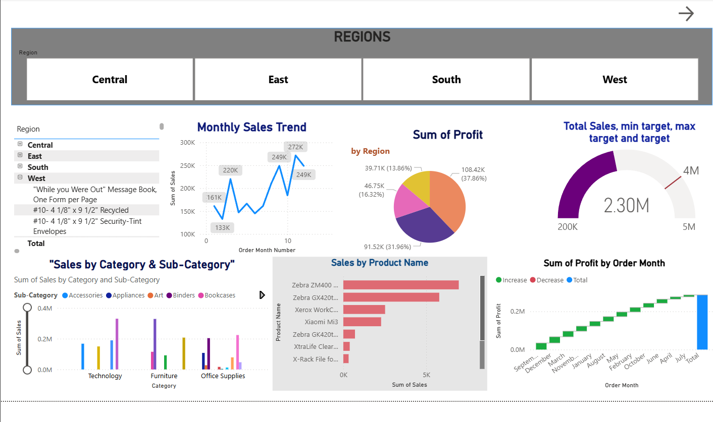

# 📊 Power BI Sales Analysis Dashboard

This project showcases an interactive dashboard built in **Power BI** using sales data. The dashboard includes KPIs, dynamic filtering, category-wise insights, and a forecast analysis.

---

## 📂 Project Files
- `Sales_Analysis_Dashboard.pbix` – Complete Power BI report
- `superstore_data.csv` – Dataset used
- `Dashboard_Overview.png` – Screenshot of dashboard view

---

## 💡 Features
- KPIs: Total Sales, Total Profit, Total Orders, Profit Margin %
- Forecasting using Power BI line chart trend projection
- Slicers for Category, Segment, Region
- Visuals: Bar Chart, Pie Chart, Line Graph, KPI Cards
- Clean, intuitive design with interactive visuals

---

## 📷 Dashboard Preview

---

## 🛠 Tools Used
- Power BI Desktop
- DAX (Data Analysis Expressions)
- Power Query
- Data Visualization Principles

---

## 🔗 Publish Status
⚠️ The dashboard is not yet published to Power BI Service due to Microsoft server delay.  
The full `.pbix` file is included and ready to open locally.

---

## 👩‍💼 About Me
Hi, I'm **Shobha Kumari**, a Data Science and Analytics enthusiast.  
This dashboard is part of my Power BI learning journey and professional portfolio.

📬 Let's connect on [LinkedIn](# 📊 Power BI Sales Analysis Dashboard

This project showcases an interactive dashboard built in **Power BI** using sales data. The dashboard includes KPIs, dynamic filtering, category-wise insights, and a forecast analysis.

---

## 📂 Project Files
- `Sales_Analysis_Dashboard.pbix` – Complete Power BI report
- `superstore_data.csv` – Dataset used
- `Dashboard_Overview.png` – Screenshot of dashboard view

---

## 💡 Features
- KPIs: Total Sales, Total Profit, Total Orders, Profit Margin %
- Forecasting using Power BI line chart trend projection
- Slicers for Category, Segment, Region
- Visuals: Bar Chart, Pie Chart, Line Graph, KPI Cards
- Clean, intuitive design with interactive visuals

---

## 📷 Dashboard Preview

---

## 🛠 Tools Used
- Power BI Desktop
- DAX (Data Analysis Expressions)
- Power Query
- Data Visualization Principles

---

## 🔗 Publish Status
⚠️ The dashboard is not yet published to Power BI Service due to Microsoft server delay.  
The full `.pbix` file is included and ready to open locally.

---

## 👩‍💼 About Me
Hi, I'm **Shobha Kumari**, a Data Science and Analytics enthusiast.  
This dashboard is part of my Power BI learning journey and professional portfolio.

📬 Let's connect on [LinkedIn](# 📊 Power BI Sales Analysis Dashboard

This project showcases an interactive dashboard built in **Power BI** using sales data. The dashboard includes KPIs, dynamic filtering, category-wise insights, and a forecast analysis.

---

## 📂 Project Files
- `Sales_Analysis_Dashboard.pbix` – Complete Power BI report
- `superstore_data.csv` – Dataset used
- `Dashboard_Overview.png` – Screenshot of dashboard view

---

## 💡 Features
- KPIs: Total Sales, Total Profit, Total Orders, Profit Margin %
- Forecasting using Power BI line chart trend projection
- Slicers for Category, Segment, Region
- Visuals: Bar Chart, Pie Chart, Line Graph, KPI Cards
- Clean, intuitive design with interactive visuals

---

## 📷 Dashboard Preview

---

## 🛠 Tools Used
- Power BI Desktop
- DAX (Data Analysis Expressions)
- Power Query
- Data Visualization Principles

---

## 🔗 Publish Status
⚠️ The dashboard is not yet published to Power BI Service due to Microsoft server delay.  
The full `.pbix` file is included and ready to open locally.

---

## 👩‍💼 About Me
Hi, I'm **Shobha Kumari**, a Data Science and Analytics enthusiast.  
This dashboard is part of my Power BI learning journey and professional portfolio.

📬 Let's connect on [LinkedIn](www.linkedin.com/in/shobha-kumari-467364267) 

